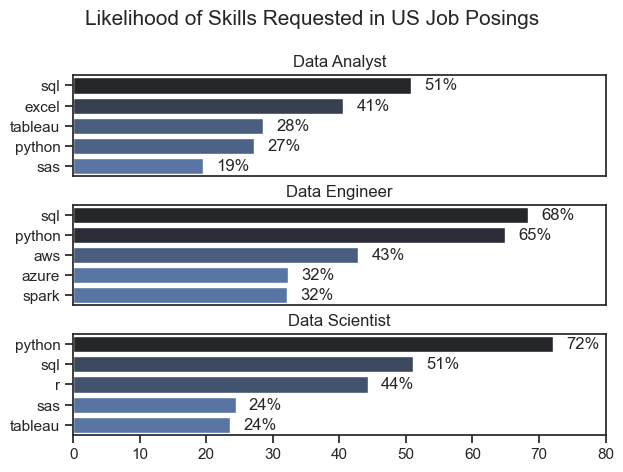
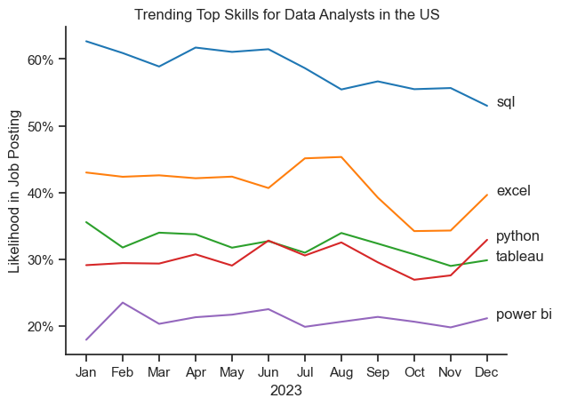
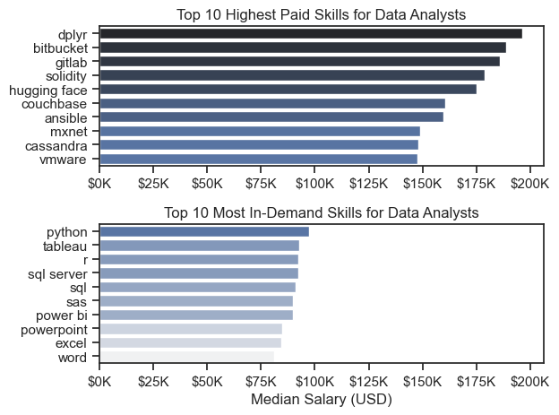
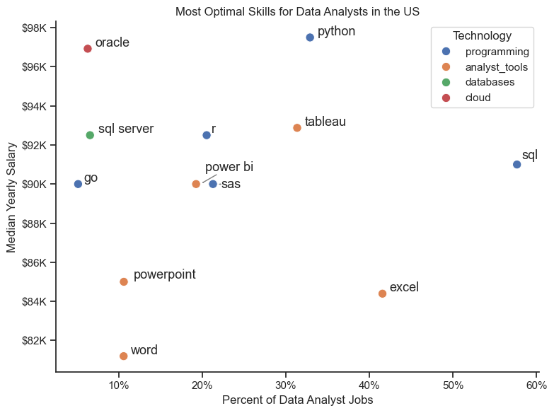

# Tools I Utilized

In my exploration of the data analyst job market, I leveraged several essential tools:

- `Python:` Served as the core of my analysis, enabling me to examine the data and uncover significant insights. I also utilized the following Python libraries:
    - `Pandas:` Used to process and analyze the dataset.
    - `Matplotlib:` Employed for generating visual representations of the data.
    - `Seaborn:` Allowed for the creation of more sophisticated and detailed visualizations.

- `Jupyter Notebooks:` The platform I used to execute my Python scripts, which provided a convenient way to incorporate notes and observations alongside the code.

- `Visual Studio Code:` My preferred editor for running Python scripts.

- `Git & GitHub:` Crucial for version control, enabling me to share my Python scripts and analyses, facilitating collaboration and keeping track of the project’s progress.

# Data Preparatin and Cleanup 

This section outlines the steps taken to prepare the data for analysis, ensuring accuracy and usability.

## Import & Clean Up Data 

I start by importing necessary libraries and loading the dataset, followed by initial data cleaning tasks to ensure data quality.

```python
# Importing Libraries
import ast
import pandas as pd
import seaborn as sns
from datasets import load_dataset
import matplotlib.pyplot as plt  

# Loading Data
dataset = load_dataset('lukebarousse/data_jobs')
df = dataset['train'].to_pandas()

# Data Cleanup
df['job_posted_date'] = pd.to_datetime(df['job_posted_date'])
df['job_skills'] = df['job_skills'].apply(lambda x: ast.literal_eval(x) if pd.notna(x) else x)
```

## Filter US Jobs

To focus my analysis on the U.S. job market, I apply filters to the dataset, narrowing down to roles based in the United States.

```Python
df_US = df[df['job_country'] == 'United States']
```

# The Analysis 

## 1. What are the most demanded skills for the top 3 most popular data roles?

To find the most demanded skills for the top 3 most popular data roles. I filtered out those positions by which ones were the most popular, and got the top 5 skills for these top 3 roles. This query highlights the most popular job titles and their top skills, showing which skills i should pay attention to depending on the role I'm targeting.

View my notebook with detailed steps here:
[2_Skill_Demand.ipynb](03_Project/02_Skill_Demand.ipynb)

### Visualize Data

```python
fig, ax = plt.subplots(len(job_titles), 1)

sns.set_theme(style="ticks")

for i, job_title in enumerate(job_titles):
    df_plot = df_skills_perc[df_skills_perc["job_title_short"] == job_title].head(5)
    sns.barplot(data=df_plot, x="skill_percent", y="job_skills", ax=ax[i], hue="skill_count", palette="dark:b_r")
    ax[i].set_title(job_title)
    ax[i].set_xlabel("")
    ax[i].set_ylabel("")
    ax[i].legend().remove()
    ax[i].set_xlim(0, 80)

    for n, v in enumerate(df_plot["skill_percent"]):
        ax[i].text(v + 2, n, f"{v:.0f}%", va="center")
    if i != len(job_titles) - 1:
        ax[i].set_xticks([])

fig.suptitle("Likelihood of Skills Requested in US Job Posings", fontsize=15)
fig.tight_layout(h_pad=0.5)  # fix the overlap
plt.show()
```

### Results


*Horizontal bar chart visualizing What are the most demanded skills for the top 3 most popular data roles*

### Insights

`SQL` and `Python` are key skills for all three roles. Each role requires a solid understanding of `SQL`, with `Python` being especially important for `Data Scientists` and `Data Engineers`.

Specialized technologies such as `AWS`, `Azure`, and `Spark` are more relevant for `Data Engineers`, while `Excel` and `Tableau` are more commonly used by `Data Analysts`.

`R` is particularly important for `Data Scientists` who are engaged in more advanced data analysis and statistics.

**Summary:**

Depending on the role, `SQL` and `Python` are of absolute priority. For more advanced roles, such as `Data Engineer` and `Data Scientist`, there is an increasing demand for knowledge of cloud technologies and big data processing tools, such as `AWS`, `Azure`, and `Spark`.


## 2. How are in-demand skills trending for Data Analysts?

To identify the highest-paying roles and skills, I only got jobs in the United States and looked at their median salary. But first I looked at the salary distributions of common data jobs like Data Scientist, Data Engineer, and Data Analyst, to get an idea of which jobs are paid the most.

View my notebook with detailed steps here:
[3_Skill_Trend.ipynb](03_Project/03_Skill_Trend.ipynb)

### Visualize Data

```python
sns.lineplot(data=df_plot, dashes=False, palette="tab10")
sns.set_theme(style="ticks")
sns.despine()

plt.title("Trending Top Skills for Data Analysts in the US")
plt.ylabel("Likelihood in Job Posting")
plt.xlabel("2023")
plt.legend().remove()

ax = plt.gca()
ax.yaxis.set_major_formatter(PercentFormatter(decimals=0))

for i in range(5):
    plt.text(11.25, df_plot.iloc[-1, i], df_plot.columns[i])
```

### Results


*Line chart visualizing the trending top skills for data analysts in the US in 2023*

### Insights

The chart shows the changing trends in skills required for data analysts in the US throughout 2023. Here is the analysis:

#### Key Observations:

`SQL:` It is the most sought-after skill throughout the year, although there is a decline from over 60% in January to around 50% by December in the number of job postings. However, it remains the most crucial skill.

`Excel:` Another important skill, remaining stable at around 40% for most of the year. There is a noticeable drop in September, but by the end of the year, Excel sees an uptick in demand.

`Python:` It stays at a 30-35% level with some fluctuations. In the second half of the year, it overtakes Tableau, indicating growing interest in this skill towards the year's end.

`Tableau:` Like Python, it hovers between 25-35%. However, compared to Python, Tableau's popularity declines, especially toward the end of the year.

`Power BI:` This is the least popular of the listed skills, remaining around 20-25% throughout the year, with no significant increases or decreases.

#### Conclusions:

`SQL` and `Excel` are key skills for data analysts.
`Python` gains traction towards the end of the year, suggesting a growing interest in programming languages for data analysis.
`Tableau` is declining in popularity.
`Power BI` remains a stable but niche skill.
In summary, data analysts need to primarily master `SQL` and `Excel`, but there is increasing emphasis on `Python`.

## 3. How well do jobs and skills pay for Data Analysts?

To pinpoint the highest-paying roles and skills, I focused solely on jobs within the United States and examined their median salaries. Initially, I reviewed the salary distributions for common data roles such as Data Scientist, Data Engineer, and Data Analyst to understand which positions offer the highest pay.

View my notebook with detailed steps here:
[4_Salary_Analysis.ipynb](03_Project/04_Salary_Analysis.ipynb)

### Visualize Data

```python
sns.boxplot(data=df_US_top6, x="salary_year_avg", y="job_title_short", order=job_sorted)

plt.title("Salary Distribution in the United Staes")
plt.xlabel("Yearly Salary ($USD)")
plt.ylabel("")
ax = plt.gca()
ax.xaxis.set_major_formatter(plt.FuncFormatter(lambda x, pos: f"${int(x/1000)}K"))
plt.xlim(0, 600000)

plt.show()
```

### Results


*Box plot visualizing the salary distributions for the top 6 data job titles*

### Insights

#### Key Observations:

`Senior Data Scientist:`

Median salary is close to $150K, with a wider distribution of salaries ranging from around $100K to $200K.
There are a significant number of outliers, with some individuals earning upwards of $400K-$500K.

`Senior Data Engineer:`

Similar to Senior Data Scientists, the median salary is also around $150K, with a range of salaries from approximately $100K to $200K.
Several outliers exist, though not as extreme as those seen for Senior Data Scientists, with salaries going up to $300K or more.

`Data Scientist:`

The median salary is around $120K, with most salaries ranging from $100K to $150K.
Numerous outliers are present, with some earning more than $300K.

`Data Engineer:`

The median salary is roughly $120K, with a distribution that is very similar to Data Scientists.
Outliers go up to $300K or slightly beyond.

`Senior Data Analyst:`

Median salary is closer to $100K, with the majority of salaries ranging from around $80K to $130K.
Fewer outliers compared to other roles, though some individuals earn more than $200K.

`Data Analyst:`

This role has the lowest median salary, around $80K.
Salaries are concentrated between $60K and $100K, with fewer extreme outliers, but some still earn over $150K.

#### Conclusions:

Senior positions (`Senior Data Scientist`, `Senior Data Engineer`) tend to have both higher median salaries and a broader distribution of salaries, suggesting more variability in pay based on experience, industry, or company size.
`Data Analysts` and `Senior Data Analysts` have lower overall salary distributions compared to the other roles, with fewer high-earning outliers.
`Data Scientists` and `Data Engineers` occupy similar salary ranges, though `Data Scientists` show more extreme high-end outliers, suggesting that certain industries may pay more for data science expertise.
In summary, the chart highlights that `senior roles` and `technical positions` in `data science` and `engineering` offer the highest earning potential, while `analytical` roles like `data analysts` tend to have lower, but more stable salary distributions.

## Highest Paid and Most Demanded Skills for Data

Next, I refined my analysis to concentrate exclusively on data analyst positions. I examined both the highest-paying and most sought-after skills, and presented these findings using two bar charts.

### Visualize Data

```python
fig, ax = plt.subplots(2, 1)

sns.set_theme(style="ticks")
sns.barplot(data=df_DA_top_pay, x="median", y=df_DA_top_pay.index, ax=ax[0], hue="median", palette="dark:b_r", legend=False)

ax[0].set_title("Top 10 Highest Paid Skills for Data Analysts")
ax[0].set_ylabel("")
ax[0].set_xlabel("")
ax[0].xaxis.set_major_formatter(plt.FuncFormatter(lambda x, _: f"${int(x/1000)}K"))

sns.barplot(data=df_DA_skills, x="median", y=df_DA_skills.index, ax=ax[1], hue="median", palette="light:b", legend=False)

ax[1].set_title("Top 10 Most In-Demand Skills for Data Analysts")
ax[1].set_ylabel("")
ax[1].set_xlabel("Median Salary (USD)")
ax[1].set_xlim(ax[0].get_xlim())
ax[1].xaxis.set_major_formatter(plt.FuncFormatter(lambda x, _: f"${int(x/1000)}K"))

fig.tight_layout()
plt.show()
```

### Results


*Two separate Horizontal bar charts visualizing the highest paid skills and most in-demand skills for data analysts in the US*

### Insights

#### `Top 10 Highest Paid Skills` for `Data Analysts` (Top Chart)
This chart shows the `highest-paid skills` for data analysts, but the number of job opportunities requiring these skills is relatively low, which drives up the salaries for those few roles.

`Dplyr` ($200K) is highly specialized and used mainly in R programming for data manipulation. Despite high pay, jobs requiring this skill are rare.

`Bitbucket` and `GitLab` (around $190K) are used for version control. These tools are essential in certain environments, but demand for data analysts needing them is limited.

`Solidity` ($185K) is a blockchain-specific language. Its application is niche, explaining the small number of high-paying roles.

`Hugging Face` ($175K) is focused on NLP and machine learning, with few roles needing this advanced skill.

`Couchbase` and `Cassandra` (above $150K) are NoSQL databases used in large-scale systems, with fewer data analyst roles requiring this expertise.

`Ansible` ($160K) is an automation tool important in infrastructure roles, but there are few job openings for analysts needing this skill.

`Mxnet` and `VMware` ($150K) are used in specialized machine learning and cloud-related roles, leading to higher pay but fewer positions.

The common theme across these high-paying skills is that the number of job openings that require them is relatively low compared to more widely-used skills. This doesn’t imply that the skills are not valuable, but rather that their application is specialized and thus leads to fewer job postings. In these niche markets, when companies do need a specialist, they are willing to pay significantly more because the supply of qualified professionals is smaller, creating a high-salary environment despite the low overall job demand.

#### `Top 10 Most In-Demand Skills` for `Data Analysts` (Bottom Chart)
The bottom chart focuses on widely used, `in-demand skills` for data analysts, which, while offering lower salaries than niche skills, are essential across many industries.

`Python` ($100K) is the most in-demand programming language for data analysis and is widely used across industries.

`Tableau` ($100K) is highly valued for data visualization and reporting in many businesses.

`R` ($95K) is popular in statistical analysis, especially in research and academia.

`SQL Server` and `SQL` (around $90K) are foundational database skills used in nearly every data analyst role.

`SAS`, `Power BI`, and `Excel` ($85K-$90K) are commonly used for reporting and analytics, making them highly demanded.

`PowerPoint` and `Word` ($80K) are general tools for communication and reporting, with widespread demand but lower pay.

#### Conclusion:
The top chart highlights that the highest-paying skills have fewer job openings, making them highly lucrative but less commonly needed. In contrast, the bottom chart shows that foundational skills like Python, SQL, and Tableau are in high demand across many industries, offering more job opportunities but at slightly lower pay due to the wider talent pool.

## 4. What is the most optimal skill to learn for Data Analysts?

To identify the most optimal skills to learn (the ones that are the highest paid and highest in demand) I calculated the percent of skill demand and the median salary of these skills. To easily identify which are the most optimal skills to learn.

View my notebook with detailed steps here:
[5_Optimal_Skills.ipynb](03_Project/05_Optimal_Skills.ipynb)

### Visualize Data

```python
plt.figure(figsize=(8, 6))
sns.scatterplot(
    data=df_plot,
    x="skill_percent",
    y="median_salary",
    hue="technology",
    s=80
)
sns.despine()
sns.set_theme(style="ticks")

# Prepare texts for adjustText
texts = []
for i, txt in enumerate(df_DA_skills_high_demand.index):
    x = df_DA_skills_high_demand['skill_percent'].iloc[i]
    y = df_DA_skills_high_demand['median_salary'].iloc[i]
    texts.append(plt.text(x + 0.5, y + 0.5, txt, fontsize=13))

# Adjust text to avoid overlap
adjust_text(texts, arrowprops=dict(arrowstyle="->", color="gray"))

# Set axis labels, title and legend
plt.xlabel('Percent of Data Analyst Jobs')
plt.ylabel('Median Yearly Salary')
plt.title("Most Optimal Skills for Data Analysts in the US")
plt.legend(title="Technology")

# Formating x, y axis
from matplotlib.ticker import PercentFormatter
ax = plt.gca()
ax.yaxis.set_major_formatter(plt.FuncFormatter(lambda y, pos: f"${int(y/1000)}K"))
ax.xaxis.set_major_formatter(PercentFormatter(decimals=0))

# Adjust layout and display 
plt.tight_layout()
plt.show()
```

### Results


*A scatter plot visualizing the most optimal skills (high paying & high demand) for data analysts in the US*

### Insights

`Python` stands out as the most lucrative skill, offering a median salary close to $98K. This suggests a high demand for advanced programming skills, especially in data manipulation, statistical analysis, and machine learning.

`SQL` is essential for database management and querying, with a median salary around $92K. SQL is one of the core skills for data analysts, valued for its versatility in handling large datasets and integrating with various platforms.

`Oracle`, in the cloud category, offers a similar high salary (around $98K), indicating that expertise in cloud-based database management systems is highly rewarded, even if it is more niche compared to SQL.

`Tableau and Power BI` are highly regarded analyst tools. `Tableau` offers a median salary of around $92K, reflecting its importance for data visualization and business intelligence reporting. `Power BI`, while slightly lower (around $90K), is also a valuable tool in data analysis roles, offering strong integration with Microsoft products.

`R` is another notable programming skill, with a median salary of around $92K. Although less commonly used than Python, R is crucial for statistical analysis and specialized in data visualization and modeling.

`SQL Server`, a specific database management system, also commands a salary around $92K. This highlights the importance of not just knowing SQL but also being proficient with specific database platforms.

`Excel and PowerPoint` remain staples for data presentation and analysis, but their median salaries are lower, around $86K, reflecting their more generalist nature compared to the specialized tools like Tableau or Power BI.

`Go`, another programming language, appears on the chart with a median salary of $90K, showing that some data analyst roles also require back-end or software development skills.

`SAS`, a specialized tool for advanced analytics, offers a salary around $90K. Though less versatile than some other programming languages, it's highly valuable in sectors that require heavy statistical analysis.

In conclusion, programming languages (`Python`, `SQL`, `R`), databases (`SQL Server`, `Oracle`), and advanced analytical tools (`Tableau`, `Power BI`) tend to offer the highest rewards in terms of salary. General tools like `Excel` and `PowerPoint`, while useful, are associated with lower earning potential in comparison to these specialized skills.
