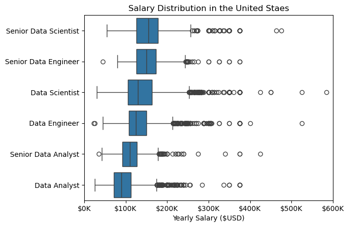

# The Analysis 

## 1. What are the most demanded skills for the top 3 most popular data roles?

To find the most demanded skills for the top 3 most popular data roles. I filtered out those positions by which ones were the most popular, and got the top 5 skills for these top 3 roles. This query highlights the most popular job titles and their top skills, showing which skills i should pay attention to depending on the role I'm targeting.

View my notebook with detailed steps here:
[2_Skill_Demand.ipynb](03_Project/02_Skill_Demand.ipynb)

### Visualize Data

```python
fig, ax = plt.subplots(len(job_titles), 1)

sns.set_theme(style="ticks")

for i, job_title in enumerate(job_titles):
    df_plot = df_skills_perc[df_skills_perc["job_title_short"] == job_title].head(5)
    sns.barplot(data=df_plot, x="skill_percent", y="job_skills", ax=ax[i], hue="skill_count", palette="dark:b_r")
    ax[i].set_title(job_title)
    ax[i].set_xlabel("")
    ax[i].set_ylabel("")
    ax[i].legend().remove()
    ax[i].set_xlim(0, 80)

    for n, v in enumerate(df_plot["skill_percent"]):
        ax[i].text(v + 2, n, f"{v:.0f}%", va="center")
    if i != len(job_titles) - 1:
        ax[i].set_xticks([])

fig.suptitle("Likelihood of Skills Requested in US Job Posings", fontsize=15)
fig.tight_layout(h_pad=0.5)  # fix the overlap
plt.show()
```

### Results


*Horizontal bar chart visualizing What are the most demanded skills for the top 3 most popular data roles*

### Insights

`SQL` and `Python` are key skills for all three roles. Each role requires a solid understanding of `SQL`, with `Python` being especially important for `Data Scientists` and `Data Engineers`.

Specialized technologies such as `AWS`, `Azure`, and `Spark` are more relevant for `Data Engineers`, while `Excel` and `Tableau` are more commonly used by `Data Analysts`.

`R` is particularly important for `Data Scientists` who are engaged in more advanced data analysis and statistics.

**Summary:**

Depending on the role, `SQL` and `Python` are of absolute priority. For more advanced roles, such as `Data Engineer` and `Data Scientist`, there is an increasing demand for knowledge of cloud technologies and big data processing tools, such as `AWS`, `Azure`, and `Spark`.


## 2. How are in-demand skills trending for Data Analysts?

To identify the highest-paying roles and skills, I only got jobs in the United States and looked at their median salary. But first I looked at the salary distributions of common data jobs like Data Scientist, Data Engineer, and Data Analyst, to get an idea of which jobs are paid the most.

View my notebook with detailed steps here:
[3_Skill_Trend.ipynb](03_Project/03_Skill_Trend.ipynb)

### Visualize Data

```python
sns.lineplot(data=df_plot, dashes=False, palette="tab10")
sns.set_theme(style="ticks")
sns.despine()

plt.title("Trending Top Skills for Data Analysts in the US")
plt.ylabel("Likelihood in Job Posting")
plt.xlabel("2023")
plt.legend().remove()

ax = plt.gca()
ax.yaxis.set_major_formatter(PercentFormatter(decimals=0))

for i in range(5):
    plt.text(11.25, df_plot.iloc[-1, i], df_plot.columns[i])
```

### Results


*Line chart visualizing the trending top skills for data analysts in the US in 2023*

### Insights
tbc.

## 3. How well do jobs and skills pay for Data Analysts?

To pinpoint the highest-paying roles and skills, I focused solely on jobs within the United States and examined their median salaries. Initially, I reviewed the salary distributions for common data roles such as Data Scientist, Data Engineer, and Data Analyst to understand which positions offer the highest pay.

View my notebook with detailed steps here:
[4_Salary_Analysis.ipynb](03_Project/04_Salary_Analysis.ipynb)

### Visualize Data

```python
sns.boxplot(data=df_US_top6, x="salary_year_avg", y="job_title_short", order=job_sorted)

plt.title("Salary Distribution in the United Staes")
plt.xlabel("Yearly Salary ($USD)")
plt.ylabel("")
ax = plt.gca()
ax.xaxis.set_major_formatter(plt.FuncFormatter(lambda x, pos: f"${int(x/1000)}K"))
plt.xlim(0, 600000)

plt.show()
```

### Results


*Box plot visualizing the salary distributions for the top 6 data job titles*

### Insights
tbc.

## Highest Paid and Most Demanded Skills for Data

Next, I refined my analysis to concentrate exclusively on data analyst positions. I examined both the highest-paying and most sought-after skills, and presented these findings using two bar charts.

### Visualize Data

```python
fig, ax = plt.subplots(2, 1)

sns.set_theme(style="ticks")
sns.barplot(data=df_DA_top_pay, x="median", y=df_DA_top_pay.index, ax=ax[0], hue="median", palette="dark:b_r", legend=False)

ax[0].set_title("Top 10 Highest Paid Skills for Data Analysts")
ax[0].set_ylabel("")
ax[0].set_xlabel("")
ax[0].xaxis.set_major_formatter(plt.FuncFormatter(lambda x, _: f"${int(x/1000)}K"))

sns.barplot(data=df_DA_skills, x="median", y=df_DA_skills.index, ax=ax[1], hue="median", palette="light:b", legend=False)

ax[1].set_title("Top 10 Most In-Demand Skills for Data Analysts")
ax[1].set_ylabel("")
ax[1].set_xlabel("Median Salary (USD)")
ax[1].set_xlim(ax[0].get_xlim())
ax[1].xaxis.set_major_formatter(plt.FuncFormatter(lambda x, _: f"${int(x/1000)}K"))

fig.tight_layout()
plt.show()
```

### Results


*Two separate Horizontal bar charts visualizing the highest paid skills and most in-demand skills for data analysts in the US*

### Insights
tbc.